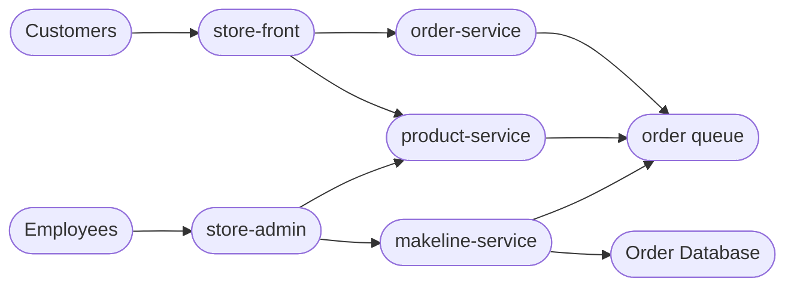

# **Best Buy Cloud‑Native Application – Microservices Deployment on AKS**

## **Overview**
This project is a cloud‑native microservices application developed for **Best Buy**, inspired by the *Algonquin Pet Store (On Steroids)* architecture.  
It consists of **5 microservices**, deployed on **Azure Kubernetes Service (AKS)** using modern DevOps practices including containerization, GitHub Actions CI/CD, ConfigMaps, Secrets, StatefulSets, and Kubernetes Deployments.

The application includes both customer‑facing and admin‑facing web portals, backend APIs, asynchronous message processing using RabbitMQ, and persistent order storage using MongoDB.

---
# Links Table

| Service          | GitHub Repo     | Docker Hub Image                               |
|------------------|-----------------|-------------------------------------------------|
| store-front      | https://github.com/surt0008/store-front-L8     | https://hub.docker.com/r/rohan2993/store-front              |
| store-admin      | https://github.com/surt0008/store-admin-L8     | https://hub.docker.com/r/rohan2993/store-admin             |
| order-service    | https://github.com/surt0008/order-service-L8    | https://hub.docker.com/r/rohan2993/order-service            |
| product-service  | https://github.com/surt0008/product-service-L8    | https://hub.docker.com/r/rohan2993/product-service         |
| makeline-service | https://github.com/surt0008/makeline-service-L8    | https://hub.docker.com/r/rohan2993/makeline-service       |

---
##  Demo Video
[YouTube Link](https://youtu.be/4AZy59K4R8s)

---
## **Microservices**

| Service | Description |
|--------|-------------|
| **store-front** | Customer-facing web app for browsing and placing orders |
| **store-admin** | Employee portal for product and order management |
| **order-service** | Handles order creation and processing |
| **product-service** | Manages Best Buy products (CRUD operations) |
| **makeline-service** | Background worker that processes orders from the queue |
| **MongoDB** | Stateful database storing order records |
| **RabbitMQ** | Message queue for asynchronous order workflow |

---

## **Updated Architecture Diagram**



##  Microservices Architecture
Each microservice is independently developed, containerized, deployed, and updated.

---

##  Kubernetes Deployment

Resources include:

- **Deployments** → Stateless frontend/admin and API services  
- **StatefulSets** → MongoDB with persistent storage  
- **ConfigMaps** → Non-sensitive settings and sensitive values  
- **Services (LoadBalancer)** → External access to store-front & store-admin  
- **RabbitMQ Queue** → Powers asynchronous order processing  
- **Makeline Worker** → Simulates real-world order fulfilment  

---

## CI/CD Automation

Each microservice includes:

- Docker image build & push  
- Automated testing  
- Automatic AKS deployment  
- Triggered on push to main branch using GitHub Actions

# Deployment Instructions

### Prerequisite
- AKS cluster created (minimum 2 nodes)
- kubectl configured
- Docker Hub account

---

## 1. Clone the Project

```bash
git clone <your-repo>
cd bestbuy-cloud-native
```

---

## 2. Build & Push Docker Images

Repeat for each microservice:
```bash
docker build -t <docker-username>/<service-name>:v1 .
docker push <docker-username>/<service-name>:v1
```
Example:
```bash
docker push rohan2993/store-front:v1
```

---

## 3. Update Kubernetes YAML Files

Inside Deployment Files/aps-all-in-one.yaml

Update username:
```bash
image: docker-username/service-name:v1
```
---

## 4. Apply ConfigMaps & Secrets

### Create ConfigMap
```bash
kubectl apply -f config-maps.yaml
```

---

## 5. Deploy the Complete Application
```bash
kubectl apply -f aps-all-in-one.yaml
```

---

## 6. Validate Deployment

```bash
kubectl get pods
kubectl get services
```

### Access the Apps
- Store Front   
- Store Admin 

---

## 7. Monitor Resource Usage
```bash
kubectl top pods
kubectl top nodes
```

# MongoDB StatefulSet & Persistence

## Enabled High Availability

- Converted MongoDB from Deployment → StatefulSet  
- Use 3 replicas for a replica set (recommended)  
- Added PersistentVolumeClaim via volumeClaimTemplates  
- Headless service (clusterIP: None) for stable DNS names  

### Example Pod Names
```bash
mongodb-0.mongodb
mongodb-1.mongodb
mongodb-2.mongodb
```

---

## Connect to MongoDB

```bash
kubectl exec -it statefulset/mongodb -- mongo
```

Inside mongo shell:

```bash
show dbs
use orderdb
db.orders.find()
```
# RabbitMQ Persistence

RabbitMQ StatefulSet includes:

- PVC mounted at /var/lib/rabbitmq to persist message store
- ConfigMap for plugins and definitions remains mounted
- Queue/messages survive pod restarts

---

## Access RabbitMQ Management UI Locally

```bash
kubectl port-forward service/rabbitmq 15672:15672
```

Then open: http://localhost:15672


Login using the configured credentials.
- Username: username
- Password: password
# CI/CD Pipeline (GitHub Actions)

Each service repository contains `.github/workflows/ci_cd.yaml` that implements:
- Build Docker image
- Run unit/integration tests
- Tag & push Docker Hub image
Updates the image on AKS using repository secrets:
## Key Environment / Repository Variables

Set the following variables in each repository:

- DOCKER_IMAGE_NAME (e.g., store-front-l9)
- DEPLOYMENT_NAME (e.g., store-front)
- CONTAINER_NAME (e.g., store-front)

##  Post-Deployment Flow Explanation

- Once the application is deployed to AKS, the workflow begins with customers accessing the store-front and employees accessing the store-admin portals through their respective LoadBalancer IPs. 
- When a customer creates an order, the order-service validates and publishes it to the RabbitMQ order queue, while product data is supplied in real time from the product-service.

- The makeline-service continuously listens to the queue, pulling incoming orders, processing them asynchronously, updating their status, and then saving the results into the persistent MongoDB replica set. 
- Admins can view or manage products and orders through the store-admin portal, which communicates directly with the product-service and MongoDB. Meanwhile, GitHub Actions CI/CD automatically builds, tests, publishes, and redeploys microservices whenever changes are pushed to the main branch, ensuring the cluster always runs the latest stable version with minimal downtime.

---

##  Conclusion

The Best Buy Cloud-Native Application successfully demonstrates a complete, production-style microservices ecosystem running on Azure Kubernetes Service (AKS). By incorporating containerized services, a managed RabbitMQ queue, persistent MongoDB storage, and GitHub Actions CI/CD automation, the system showcases how modern cloud applications can be built with scalability, resilience, and modularity in mind. Each microservice is independently deployable and maintainable, while shared resources like queues and databases ensure reliable communication and data consistency across the entire platform. The architecture not only reflects real-world enterprise patterns but also provides a strong foundation for future improvements, such as migrating to managed Azure equivalents or adding autoscaling and monitoring enhancements.


